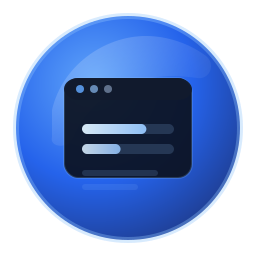
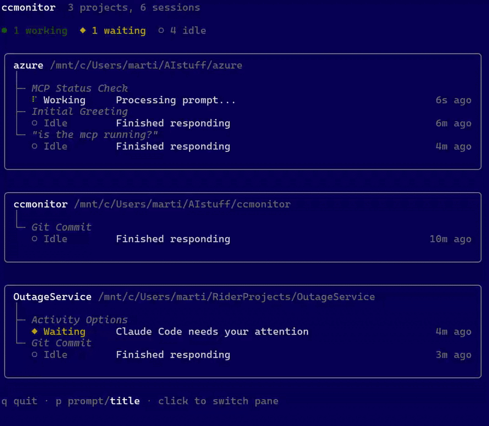

<div align="center">
  
  <h1 style="font-size: 28px; margin: 10px 0;">Claude Code Monitor</h1>
  <p>A terminal dashboard for Claude Code sessions!</p>
</div>


`ccmonitor` shows what every CC instance is doing *right now*.

Less hunting for correct terminal tab...



- Shows all sessions at a glance, grouped by project
- Shows which Claude sessions are working, waiting for input, or just idling
- It also shows your latest prompt (or summary) for each session
- Click to jump to the right tmux pane or Windows Terminal tab

# Install

Two steps. Install the binary and register the hooks:

### 1. Install the binary

**Quick install** (Linux/macOS):

```sh
curl -sSfL https://raw.githubusercontent.com/martinwickman/ccmonitor/main/install.sh | sh
```

**Manual download**: grab the [binary](https://github.com/martinwickman/ccmonitor/releases) for your platform and put it somewhere in your $PATH.

**From source** (requires [Go](https://go.dev/) 1.24+):

```sh
go install github.com/martinwickman/ccmonitor/cmd/ccmonitor@latest
```

### 2. Register the hooks

In any Claude Code session, run:

```
/plugin marketplace add martinwickman/cc-plugins
/plugin install ccmonitor
```

**For manual installation:** Edit your `~/.claude/settings.json` file by adding the [hooks](https://github.com/martinwickman/ccmonitor/plugin/hooks/hooks.json).

Note that the `ccmonitor` binary must be on your $PATH for the hooks to work.

# Usage

Open your terminal and run:

```sh
ccmonitor
```

- Press `q` to quit
- `p` to toggle between prompt or summary display
- Click a session to switch to its tmux pane or Windows Terminal tab.

Print a one-time snapshot and exit:

```sh
ccmonitor --once
```

## Quirks

`ccmonitor` cleans up dead sessions automatically. However, the way
Claude Code hooks works makes this a bit shaky. If you end up with duplicate sessions in the list,
run `ccmonitor --clean` to remove all stale sessions.

The summary display may lag or be wonky from time to time, again because of how Claude Code hooks work and the limited info we get from Claude.

## Platform support

Works on Windows, Linux, and macOS. The plugin hooks call `ccmonitor hook` directly — no shell wrapper scripts, no bash dependency.

| Feature               | Linux/macOS | Windows |
|-----------------------|-------------|---------|
| Status monitoring     | Yes         | Yes     |
| Click-to-switch tmux  | Yes         | Yes     |
| Click-to-switch WT tab| —           | Yes     |

# Uninstall

Remove the hooks: `/plugin uninstall ccmonitor`

Remove the binary: `rm $(which ccmonitor)`

# How it works

The hooks report session status by keeping state in your home directory (`~/.ccmonitor/`) which the monitor reads and displays.

# Future work

* Add click-to-tab support for more terminals (e.g. Iterm2 etc)
* Show the display in a browser
* Control Claude Code via the monitor. 